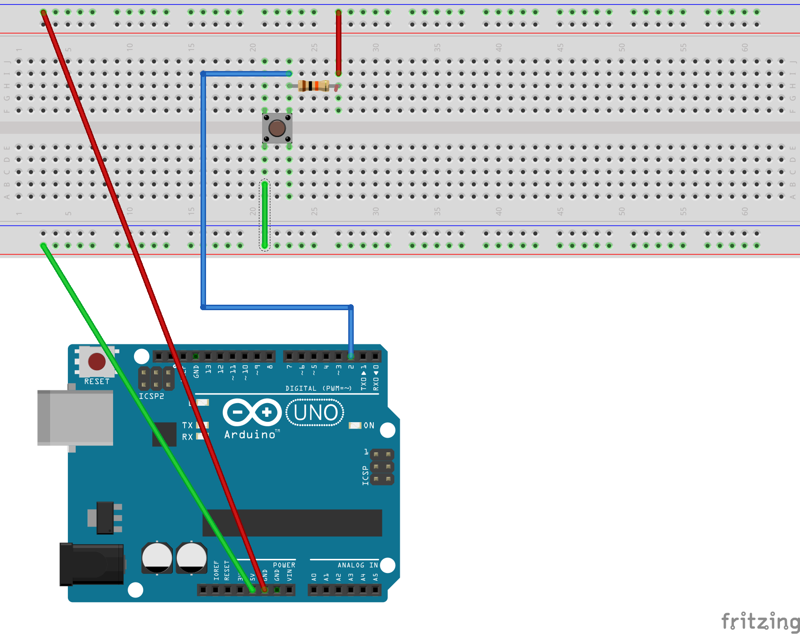

# Arduino <> Node.js <> Websocket <> Browser
This Project connects an Arduino with a simple button to a tone-producing browser app through a Node.js websocket connection.

## Getting Started
You need [Node.js](https://nodejs.org/) installed, i used version 8.9.3 when i created this. 
You need [the Arduino IDE](https://www.arduino.cc/en/Main/Software) installed.
You need an Arduino, a breadboard, a 10k resistor, a button and a bunch of jumper cables.

Go to your Console/Bash/Terminal. Clone this repository, cd into it.
Run `npm install`
Run `npm start`
Now open http://localhost:3000 in a mordernish browser that supports the [Web Audio API](https://caniuse.com/#search=Web%20Audio%20API). Look up your IP address in the local network and go to http://{yourcomputersIP}:3000 with your phone or other computers. Turn on sound, press the button.

Connect your Arduino through USB, get it wired like this:

And load the TriggerButtonSerial.ino onto the Arduino. Press Button while devices are still on that site. Modify code & have fun.